# Documentación del Proyecto

## Descripción
Este proyecto se encarga de integrar varias funcionalidades de un sistema de torneos, incluyendo la gestión de torneos, participantes, juegos y equipos, mediante la interacción con una API externa. Los datos se obtienen mediante solicitudes HTTP a la API y se muestran en plantillas HTML renderizadas en Django.

## Estructura de Archivos

- **views.py**: Contiene las vistas que manejan la lógica de la aplicación y la interacción con la API externa.
- **.env**: Archivo donde se almacenan las variables de entorno (como claves de acceso) que no deben ser hardcodeadas.
- **templates/**: Carpeta que contiene las plantillas HTML donde se visualizan los datos obtenidos de la API.

---

## **Flujo de Funcionalidad**

### 1. **Configuración de Variables de Entorno**

En el archivo `.env` se deben definir las siguientes claves:

- **USER_KEY_ADMINISTRADOR**: Clave de API para el administrador.
- **USER_KEY_JUGADOR**: Clave de API para el jugador.
- **USER_KEY_ORGANIZADOR**: Clave de API para el organizador.

Esto permite una gestión segura de las claves sin necesidad de incluirlas directamente en el código.

---

### 2. **Vistas y Funciones**g

#### **Vistas Principales**

Las vistas están diseñadas para interactuar con la API externa y mostrar los datos en plantillas HTML.

# Respuestas a las preguntas

1. **Por cada petición que hemos hecho, se ha incluido siempre lo siguiente: `http://127.0.0.1:8000/api/v1/libros/`, ¿qué pasaría si en un futuro, la versión cambia? ¿Deberíamos cambiarlo en todos los sitios de la aplicación? ¿Cómo podríamos mejorarlo?**

   Si en el futuro la versión de la API cambia, tendríamos que actualizar todas las URLs en el código, lo cual es un problema estar cambiandolo constantemenete. Para evitar esto, lo mejor es definir la versión de la API en una variable y usar esa variable en todas las peticiones. Así, si la versión cambia, solo tenemos que actualizar la variable en un solo lugar. En el código, ya hemos hecho esto definiendo `API_VERSION` y `API_BASE_URL`.

2. **Para la respuesta siempre incluimos la misma línea: `response.json()`. ¿Qué pasaría si en el día de mañana cambia el formato en una nueva versión, y en vez de json es xml? ¿Debemos volver a cambiar en todos los sitios esa línea?**

   Si el formato de la respuesta cambia de JSON a XML, tendríamos que cambiar `response.json()` en todos los lugares donde lo usamos. Para evitar esto, hemos creado una función `process_response` que maneja diferentes formatos de respuesta. Así, si el formato cambia, solo necesitamos actualizar esa función.

3. **¿Siempre debemos tratar todos los errores en cada una de las peticiones?**

   No, no siempre es necesario tratar todos los errores en cada petición. Sin embargo, es una buena práctica manejar los errores comunes y tener una función general para tratar errores específicos. En el código, hemos implementado funciones como `tratar_errores`, `mi_error_404`, y `mi_error_500` para manejar errores de manera centralizada.

Invoke-WebRequest -Uri "http://127.0.0.1:8000/oauth2/token/" `
                  -Method POST `
                  -Body "grant_type=password&username=javier&password=elpepe34&client_id=loloid&client_secret=lolosecreto" `

Invoke-WebRequest -Uri "http://127.0.0.1:8000/oauth2/token/" `
                  -Method POST `
                  -Body "grant_type=password&username=admin&password=admin&client_id=pepeid&client_secret=pepesecreto" `
                  -ContentType "application/x-www-form-urlencoded"

# 🎮 Aplicación de Gestión de Torneos  

Bienvenido a la aplicación de gestión de torneos.  
Esta aplicación permite a los usuarios registrarse, iniciar sesión y gestionar torneos, jugadores y participantes.  

---

## 🚀 Instalación y Configuración  

### 1️⃣ Clonar el repositorio  

Para obtener el código fuente del proyecto, ejecuta:  

    git clone git@github.com:mohies/Cliente.git 
    cd Cliente  

---

### 2️⃣ Configurar variables de entorno  

Crea un archivo **`.env`** en la raíz del proyecto y define las siguientes variables:  

    API_VERSION=v1  
    API_BASE_URL=https://mohbenbou.pythonanywhere.com/api/v1/  
    API_BASE_TOKEN=https://mohbenbou.pythonanywhere.com/  

Asegúrate de que el archivo `.env` está en el `.gitignore` para evitar que se suba al repositorio:  

    echo ".env" >> .gitignore  

---

### 3️⃣ Crear y activar el entorno virtual  

En **macOS y Linux**:  

    python3 -m venv venv  
    source venv/bin/activate  

En **Windows**:  

    python -m venv venv  
    venv\Scripts\activate  

---

### 4️⃣ Instalar dependencias  

Con el entorno virtual activado, instala las dependencias del proyecto:  

    pip install -r requirements.txt  

---

### 5️⃣ Aplicar Migraciones  

Ejecuta las migraciones para preparar la base de datos:  

    python manage.py migrate  

---

### 6️⃣ Crear un superusuario (Opcional)  

Si deseas acceder al panel de administración, crea un superusuario:  

    python manage.py createsuperuser  

Sigue las instrucciones en pantalla para configurar el usuario y la contraseña.  

---

### 7️⃣ Ejecutar el servidor  

Para iniciar el servidor, usa el comando:  

    python manage.py runserver  

---

## 🖥️ Capturas de Pantalla  

### 🔹 Página principal (sin autenticación)  

Si no nos hemos autenticado, solo podremos ver la web de la siguiente manera si nos ponemos a ver las listas:  

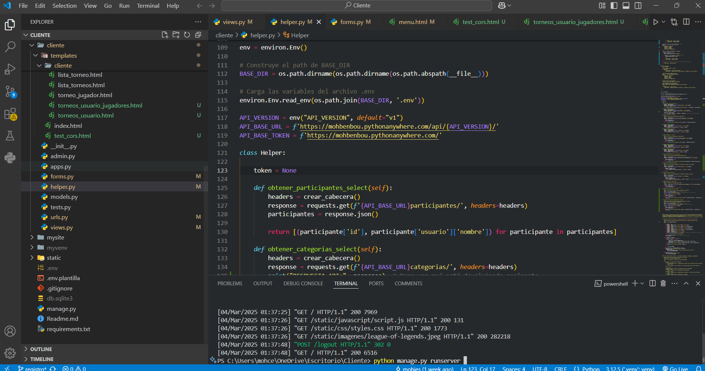  

---

### 🔹 Ir a la web de cliente con conexión a PythonAnywhere  

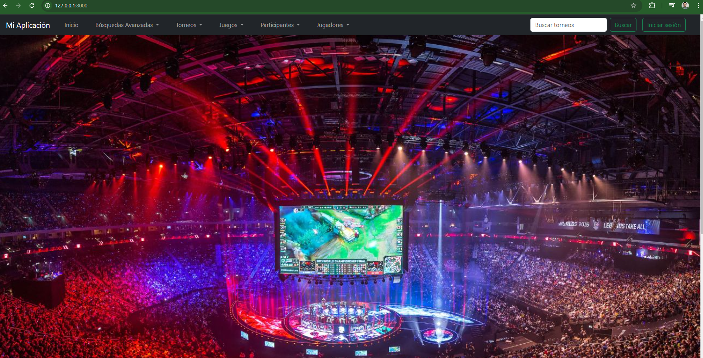  

---

### 🔹 Registro e Inicio de Sesión  

Para acceder a la aplicación, debemos **registrarnos** o **iniciar sesión**:  

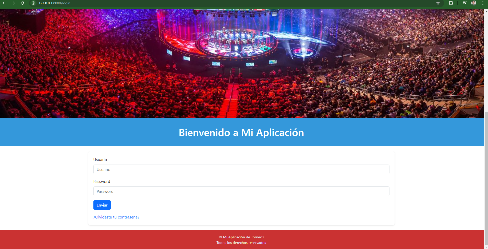  

---

### 🔹 Inicio de Sesión como Organizador  

Cada rol tiene permisos distintos. Aquí vemos un **organizador autenticado**:  

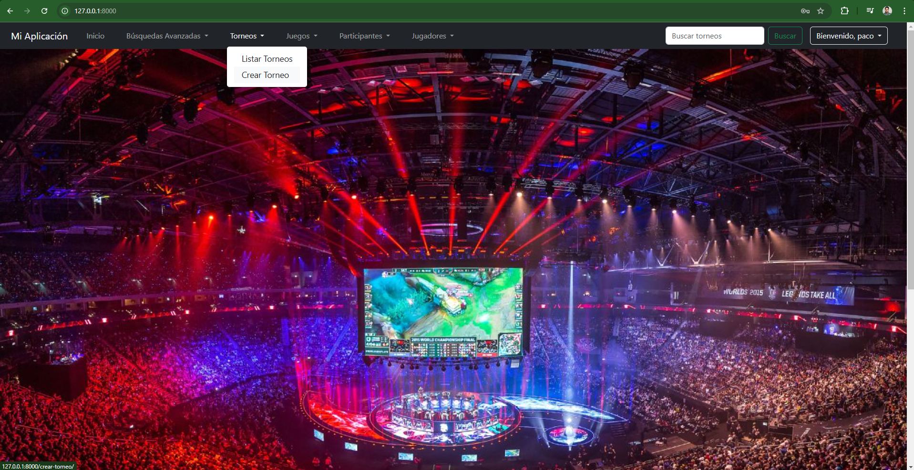  

---

### 🔹 Creación de un Torneo  

Un organizador puede **crear un torneo** fácilmente:  

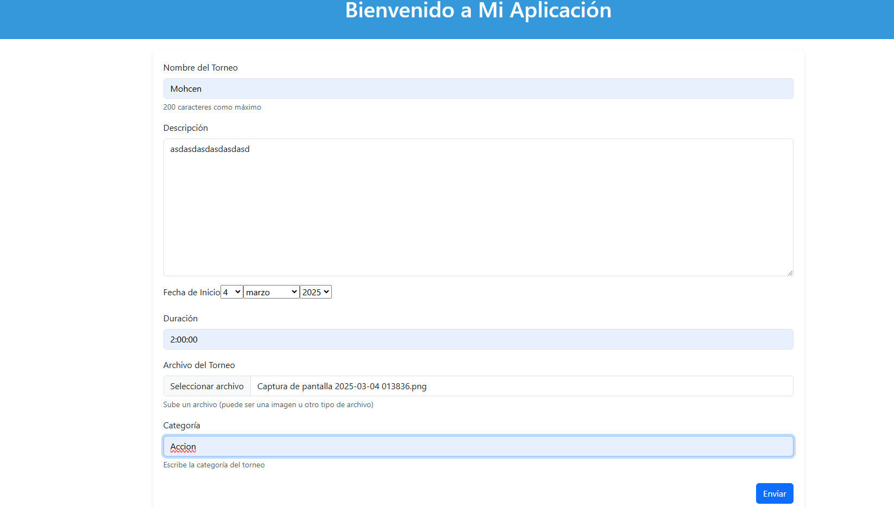  

Luego, podremos ver el torneo con el nombre del organizador que lo ha creado:  

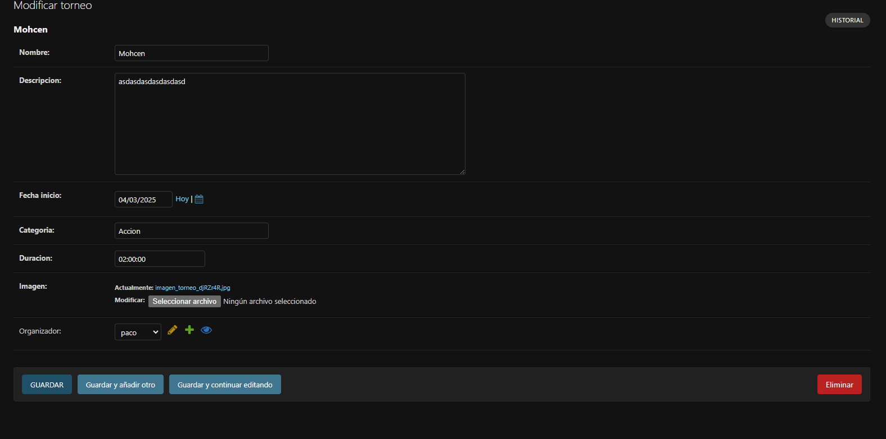  

---

### 🔹 Edición de un Torneo  

Podemos **editar un torneo**, por ejemplo, cambiando su nombre, hora o descripción:  

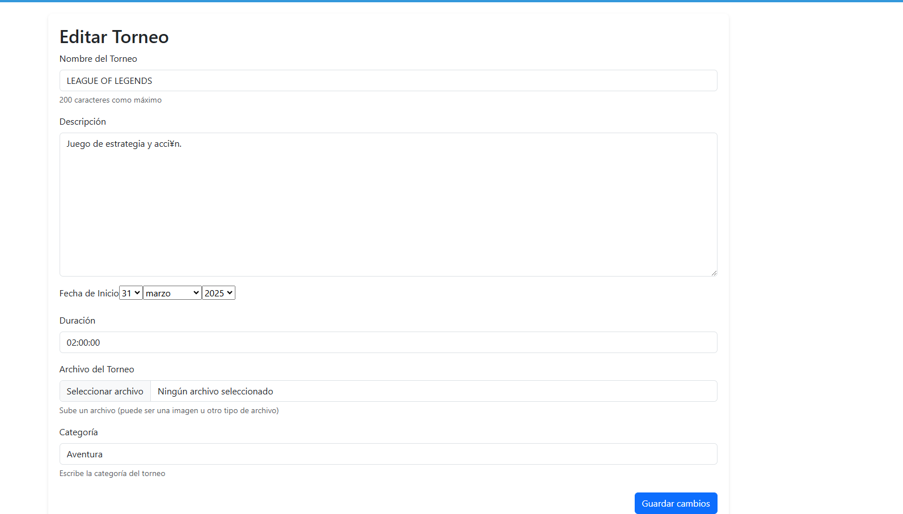  
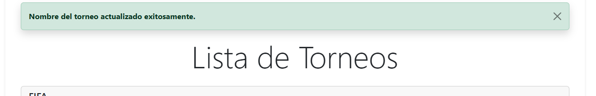  

Al pulsar el botón de **guardar cambios**, el nombre del torneo se actualizará correctamente:  

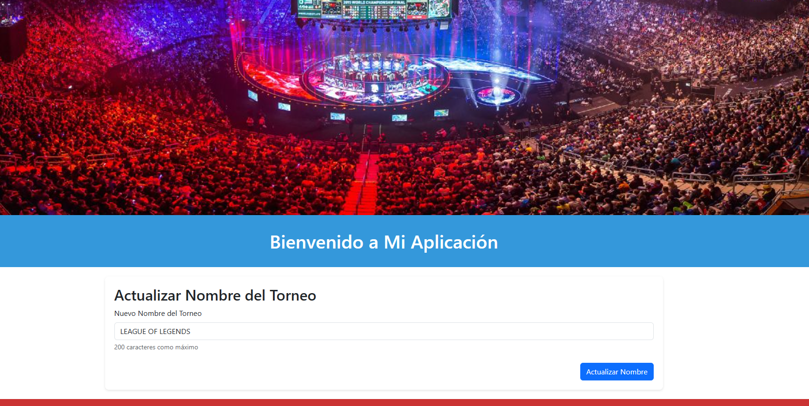  

---

### 🔹 Eliminación de un Torneo  

Si tenemos los permisos adecuados, también podemos **eliminar un torneo**:  

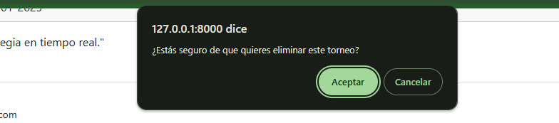  
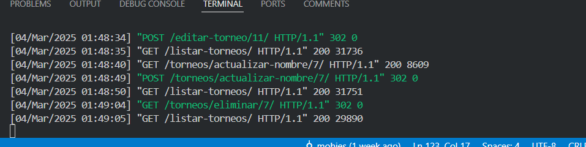  

---

## 🎯 Conclusión  

Este proyecto permite una gestión completa de torneos, incluyendo:  

✅ **Registro e inicio de sesión** con roles personalizados.  
✅ **Creación, edición y eliminación de torneos** con permisos específicos.  
✅ **Interfaz intuitiva y conexión con PythonAnywhere**.  

---

